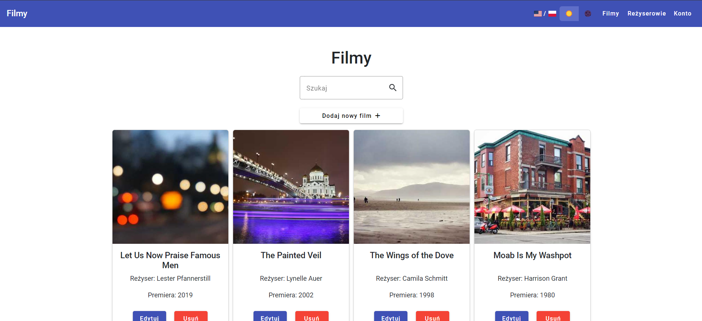
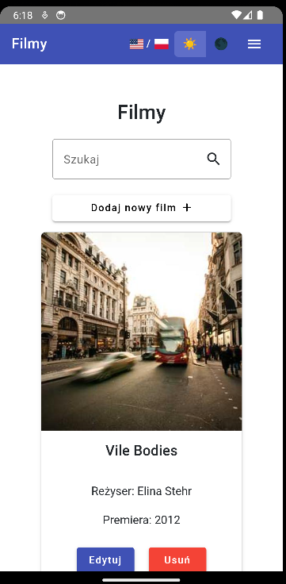
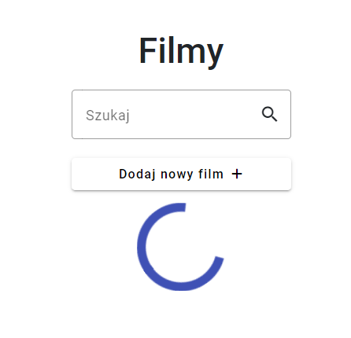
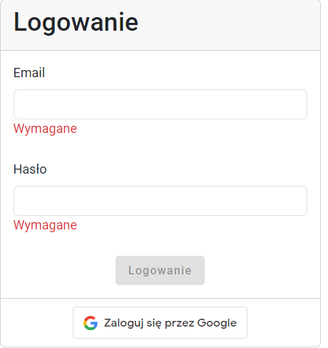
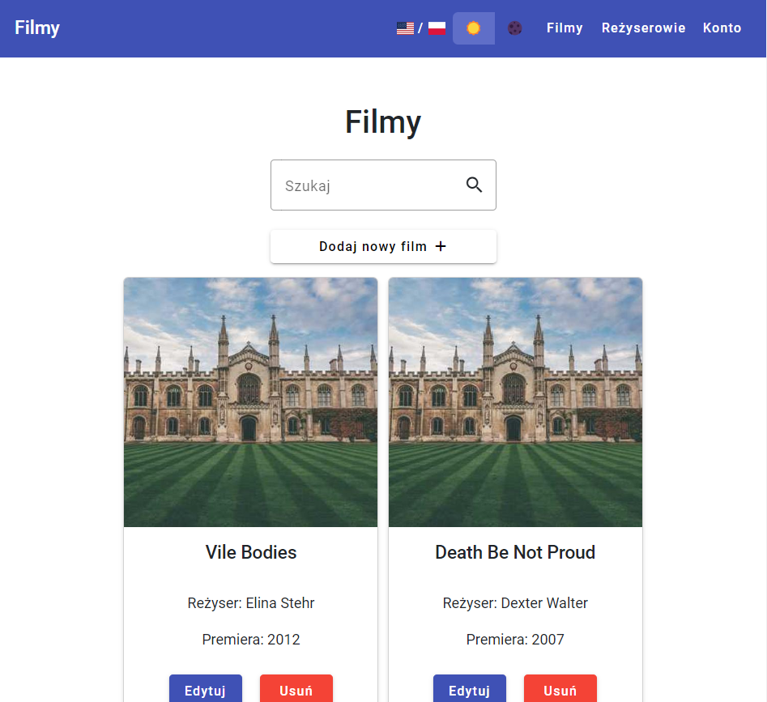
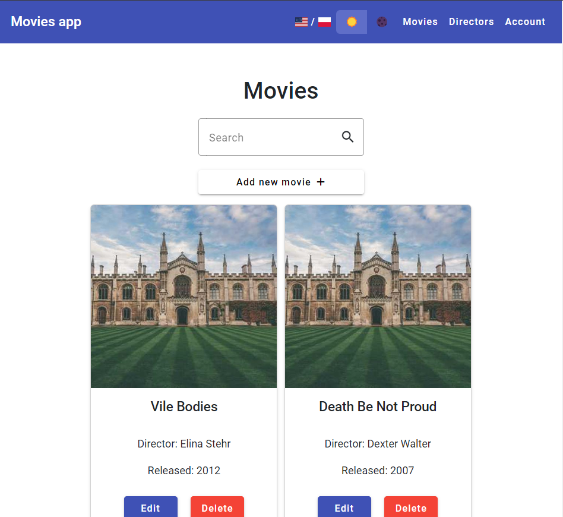
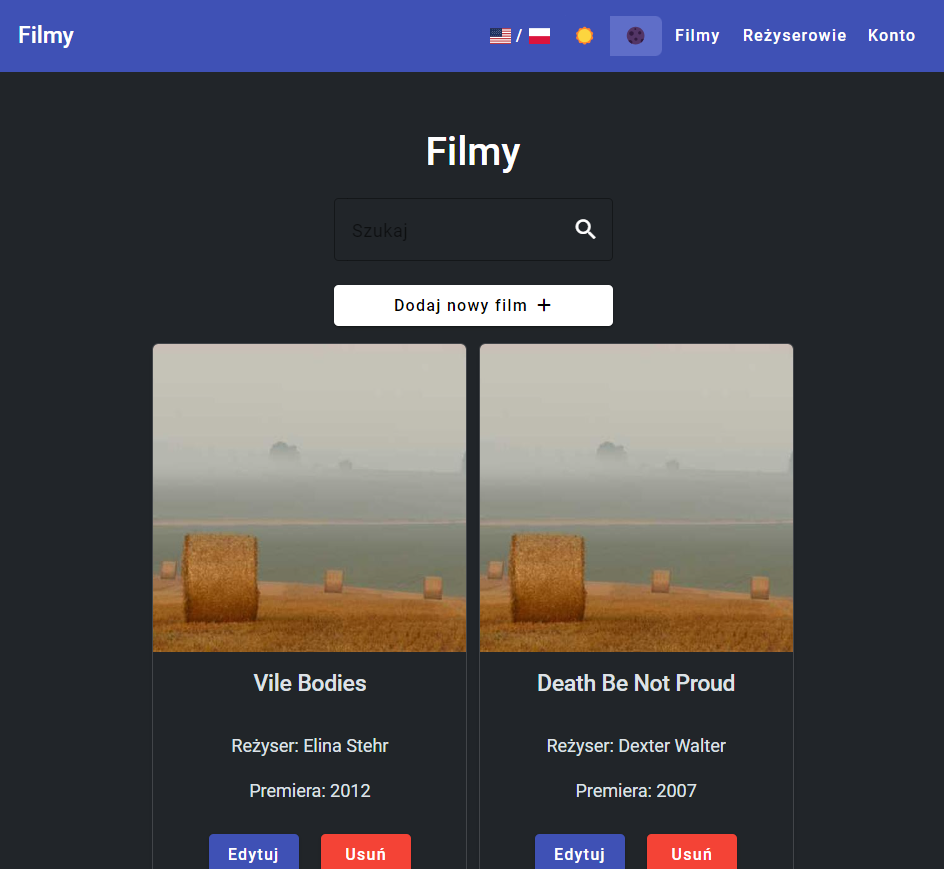
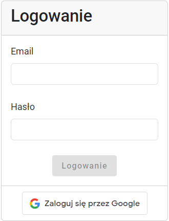
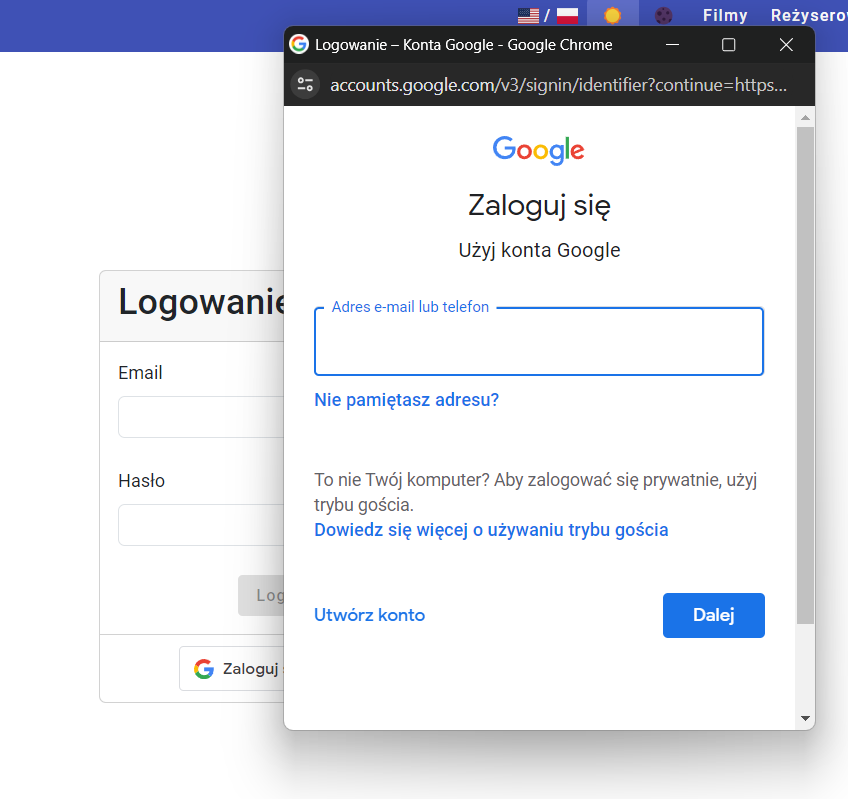

# Pamiw - Projekt

## Aplikacja

Aplikacja została stworzona przy użyciu **Java Spring Boot** oraz **Angular**.
Aplikacja zawiera podstawowe operacje CRUD na filmach oraz reżyserach.

Ponadto aplikacja zawiera funkcjonalności takie jak:

- możliwość wyboru języka (polski/angielski)
- tryb jasny i ciemny
- social login z Google
- logowanie przez e-mail wykorzystując JWT

## Uruchomienie aplikacji

Backend jest hostowany na publicznym serwerze.
W celu uruchomienia frontendu należy użyć poleceń

```bash
npm install
ng serve
```

Aplikacja uruchomi się pod adresem `http://localhost:4200/`.

## Zrealizowane funkcjonalności

### Kompatybilność aplikacji mobilnej

W ramach projektu powstała aplikacja mobilna dostępna na urządzenia z systemami
Android oraz iOS. Aplikacja została wykonana przy pomocy **Capacitor by Ionic**.
<br>
<video src="markdown/mobilna.mp4" controls title="Aplikacja mobilna"></video>

### Udoskonalenie interfejsu aplikacji mobilnej i webowej

#### Spójność wizualna

Aplikacja webowa oraz mobilna są spójne.
<br>
Webowa:
<br>

<br>
Mobilna:
<br>


#### Wysokiej jakości ikony i grafika


#### Odpowiedź interfejsu


#### Wykorzystanie gotowych szablonów

Wykorzystano gotowe komponenty [Bootstrap](https://getbootstrap.com/) oraz [Angular Material](https://material.angular.io/)

#### Walidacja
Blokowanie przycisku, wyświetlanie odpowiednich komunikatów dla użytkownika


### Ustawienia użytkownika

#### Wielojęzyczność

Obsługa języków polskiego i angielskiego
<br>
Polski:

<br>
Angielski:

<br>

#### Tryb jasny/ciemny
Tryb jasny został przedstawiony powyżej.
Tryb ciemny prezentuje się następująco:
<br>


### Opcje logowania/rejestracji

Logowanie wykorzystując konto Google



### Dostęp do zasobów sprzętowych

Aplikacja mobilna posiada dostęp do aparatu.
Zostało to przedstawione na filmie prezentującym działanie aplikacji.

### Warstwa serwisów dla aplikacji mobilnej i webowej

Dzięki użyciu narzędzia **Capacitor** aplikacja mobilna bez problemu korzysta z tych samych serwisów, które zostały napisane dla aplikacji webowej.
